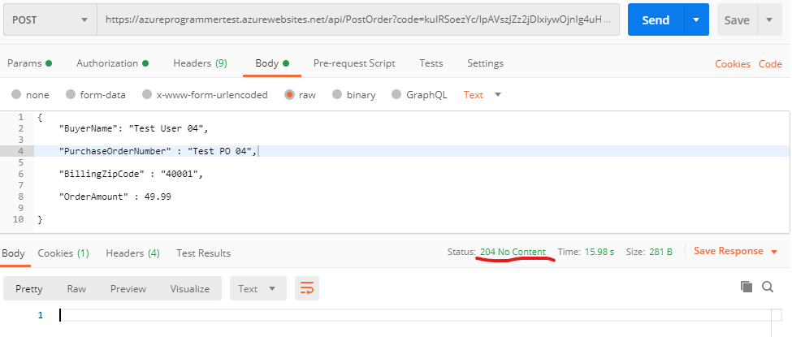
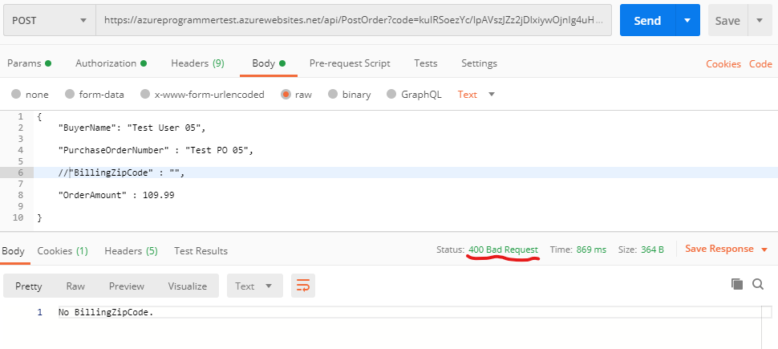

# Azure Functions App Test Instruction

This test usually takes one to two hours to finish if you have the experience. 

You have up to five hours to finish it from the time we send this test description link to you. 

Email your code to qingfeng.tan@hurraymart.com before the deadline. Make sure the code file includes the script to creat the database. If you use Visual Studio develop the project, zip the whole solution and email the zip file.

If you can finsh the optional ["Publish this Funciton App to Azure"](#publish-this-funciton-app-to-azure-optional), send the API link with your code together. 

## Level 1: Use C# to create an Azure Functions App with the following two Web APIs.

```diff
- If you don't know how to use Azure Funciton App, you can use ASP.NET Web API.
```

### 1. PostOrder

This API acceptes a http post request and creates the order in SQL database

- Order Structure  

    An order has four fields, BuyerName, PurchseOrderNumber, BillingZipCode, OrderAmount.  

    Here is a json sample: 
    
    ``` json 
    {
	    "BuyerName": "Test User 04",
	
	    "PurchaseOrderNumber" : "Test PO 04",

	    "BillingZipCode" : "40001",

	    "OrderAmount" : 49.99
    }
    ```

- If PurchaseOrderNumber exists in the database, return http status code 204.

- If any field is missing, reject it with a http status code 400.

- If the order is created successfully, return http status code 201.

- Sample

    Send post request to this url  
     https://azureprogrammertest.azurewebsites.net/api/PostOrder?code=kuIRSoezYc/IpAVszJZz2jDlxiywOjnIg4uHYaA1aM1A6v9xeH0tCQ== <br /><br />
        
    - PurchseOrderNumber exists in the database, return http status code 204
    
        

    - BillingZipCode is missing, reject it with http status code 400
        

    - Order is created successfully, return http status code 201
        


### 2. GetOrders
This API acceptes a http get request and return the list of matched orders. Filters on BuyerName, PurchaseOrderNum and BillingZipCode should also be implemented.

- Sample
    Send GET request to this url  
    https://azureprogrammertest.azurewebsites.net/api/GetOrders?code=kuIRSoezYc/IpAVszJZz2jDlxiywOjnIg4uHYaA1aM1A6v9xeH0tCQ== <br /><br />

    - Without any filter, returns all orders in the database. 
     https://azureprogrammertest.azurewebsites.net/api/GetOrders?code=kuIRSoezYc/IpAVszJZz2jDlxiywOjnIg4uHYaA1aM1A6v9xeH0tCQ== 
        
    - Apply filter on BuyerName, only returns the matched record.
    https://azureprogrammertest.azurewebsites.net/api/GetOrders?BuyerName=Test%20User%2004&code=kuIRSoezYc/IpAVszJZz2jDlxiywOjnIg4uHYaA1aM1A6v9xeH0tCQ==
        
    - Apply filter on PurchaseOrderNum, only returns the matched record.
    https://azureprogrammertest.azurewebsites.net/api/GetOrders?PurchaseOrderNumber=Test%20PO%2002&code=kuIRSoezYc/IpAVszJZz2jDlxiywOjnIg4uHYaA1aM1A6v9xeH0tCQ==
        
    - Apply filter on BillingZipCode, only returns the matched record.
    https://azureprogrammertest.azurewebsites.net/api/GetOrders?billingZipCode=30001&code=kuIRSoezYc/IpAVszJZz2jDlxiywOjnIg4uHYaA1aM1A6v9xeH0tCQ==
        


## Level 2:  Publish this Funciton App to Azure

Once you publish this Azure Fuctions App, send the Web API link to qingfeng.tan@hurraymart.com with your code together.

## Level 3: UNIT Test

### You have two options to write UNIT test.
1. Unit test for the Web API, which may take much more time if you never practiced it before.
2. Unit test for database operation. If you choose this one, make sure you separete the data access code, so you can write unit test.

### UNIT test must cover the following case
1. Successfully insert a new record
2. Cannot insert record with duplicate PurchaseOrderNumber
3. Cannot insert record without billing zip code
4. Succeffully retrieve an exsiting record


## Level 4 Auto Deploy

